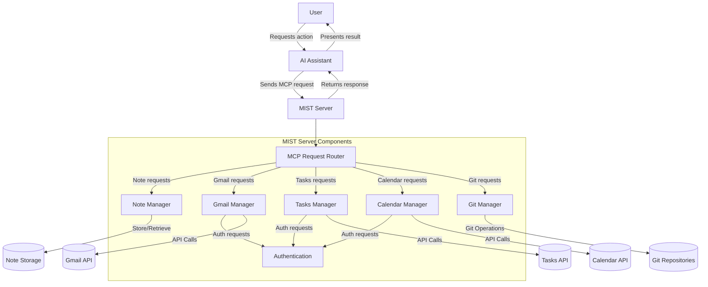
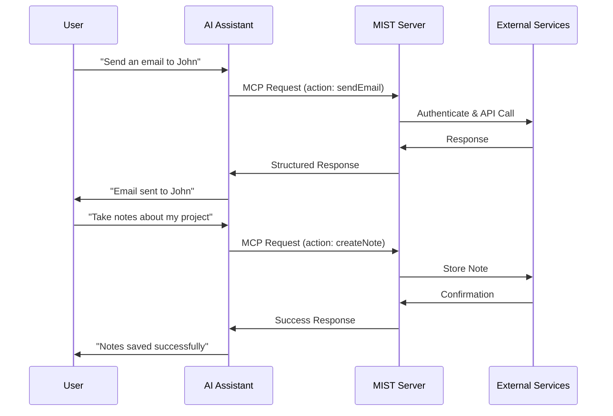
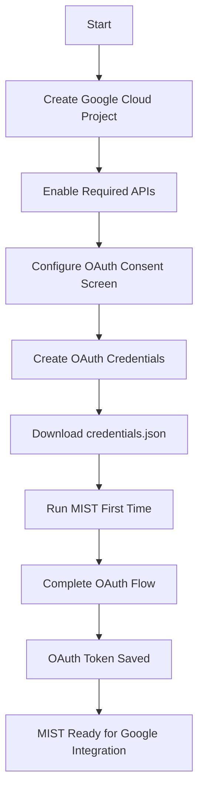

# MIST - Model Intelligence System for Tasks


MIST is a comprehensive MCP (Model Context Protocol) server that empowers AI assistants with real-world capabilities for note management, Gmail, Calendar, Tasks, and Git integration. It bridges the gap between AI assistants and external tools, enabling them to interact with your data and services through a standardized protocol.

[](https://opensource.org/licenses/MIT)
[](https://www.python.org/downloads/)
[](https://github.com/cloaky233/mist)

## Overview

MIST allows AI assistants to:

- **Manage notes**: Create, edit, search, and organize notes with persistent storage
- **Interact with Gmail**: Search emails, read messages, send emails, manage labels
- **Manage calendar events**: View, create, update, and delete Google Calendar events
- **Organize tasks**: Create task lists, add tasks, mark tasks as complete
- **Work with Git repositories**: Perform Git operations like status, diff, commit, branch management

By implementing the Model Context Protocol (MCP), MIST enables AI assistants to perform actions in external systems, access real-time information, and maintain context across interactions.

## Key Features

### Note Management
- Create and store notes with rich text formatting
- Search notes by content, tags, or metadata
- Generate summaries of notes or collections
- Organize notes by subject, date, or custom categories
- Store notes locally in your filesystem

### Gmail Integration
- Search emails with advanced filtering options
- Read complete email content
- Compose and send emails
- Manage email labels and organization
- Mark messages as read/unread
- Batch operations for multiple messages

### Calendar Integration
- List all available calendars
- Create and manage calendar events
- Update existing events
- Search events by keyword or date range
- View detailed event information

### Tasks Integration
- List and manage task lists
- Create tasks with titles, notes, and due dates
- Mark tasks as complete
- Delete completed tasks
- Organize tasks into different lists

### Git Integration
- Perform Git operations in local repositories
- View status, diffs, and commit history
- Commit changes and manage branches
- Create, checkout and merge branches
- Manage remote repositories
- Display commit details and changes

## Future Roadmap

MIST is continuously evolving to offer more integrations and features. Here's what we're planning to add:

### Document & File Management
- **Google Drive Integration**: Access and manage files, search documents, and analyze content
- **Google Sheets Integration**: Create, read, and update spreadsheets for data analysis

### Search & Information Access
- **Google Custom Search**: Enable web search capabilities for research and information retrieval
- **Knowledge Base**: Build local repositories of information for offline access

### Collaboration Tools
- **Google Classroom**: Access courses, assignments, and educational materials
- **Google Chat**: Interact with chat spaces and messages for team collaboration

### Data & Location Services
- **Google Forms**: Create and manage forms for data collection
- **Google Maps**: Add location-based services including geocoding and directions

### Platform Improvements
- **Enhanced Caching**: Improve performance for frequently accessed data
- **Multi-User Support**: Add user profiles and permission management
- **Expanded AI Assistant Compatibility**: Support more AI assistants and models

We welcome contributions in any of these areas! Check our [Contributing Guidelines](CONTRIBUTING.md) for more information on how to get involved.

## System Architecture

MIST operates as an MCP server that connects AI assistants to various services. It handles authentication, data retrieval, and actions with the appropriate services, returning structured data back to the AI assistant.



### Communication Flow



## Installation

### Prerequisites

- Python 3.13 or newer
- UV package manager (recommended) or pip
- Google account (for Gmail/Calendar/Tasks integration)
- Git (for Git integration features)

### Setup

1. Clone this repository:

   ```bash
   git clone https://github.com/cloaky233/mist.git
   cd mist
   ```

2. Install dependencies:

   **With UV (recommended)**:
   ```bash
   uv install
   ```

   **With pip**:
   ```bash
   pip install -e .
   ```

3. Configure your environment:

   ```bash
   # Create a .env file with your configuration
   echo "MIST_NOTES_DIR=/path/to/your/notes/directory" > .env
   echo "MIST_GOOGLE_CREDENTIALS_PATH=./credentials.json" >> .env
   echo "MIST_GOOGLE_TOKEN_PATH=./token.json" >> .env
   ```

   Edit the `.env` file to set the correct paths for your environment.

### Environment Configuration

The following environment variables can be set in your `.env` file:

```env
# Notes storage configuration
MIST_NOTES_DIR=/path/to/notes/directory

# Google API configuration
MIST_GOOGLE_CREDENTIALS_PATH=./credentials.json
MIST_GOOGLE_TOKEN_PATH=./token.json
```

## Google API Configuration

### Setting up Gmail, Calendar, and Tasks APIs



1. **Create a Google Cloud Project**

   - Navigate to the [Google Cloud Console](https://console.cloud.google.com/)
   - Create a new project or select an existing one
   - Give it a descriptive name (e.g., "MIST Integration")

2. **Enable Required APIs**

   - Go to "APIs & Services" > "Library"
   - Search for and enable:
     - Gmail API
     - Calendar API
     - Tasks API

3. **Configure OAuth Consent Screen**

   - Go to "APIs & Services" > "OAuth consent screen"
   - Select "External" user type (or "Internal" for Google Workspace)
   - Fill in required information:
     - App name: "MIST Integration"
     - User support email: Your email address
     - Developer contact information: Your email address
   - Click "Save and Continue"
   - Add necessary scopes for each API
   - Add your Google account as a test user

4. **Create OAuth Credentials**

   - Go to "APIs & Services" > "Credentials"
   - Click "Create Credentials" > "OAuth client ID"
   - Select "Desktop application" as the application type
   - Enter a name (e.g., "MIST Desktop Client")
   - Download the JSON file and save it as `credentials.json` in your project directory


## Usage

### Running the MCP Server

Start the MCP server with:

```bash
uv run --with mcp[cli] --with-editable . mcp run mist/server.py
```

For production use, you may want to use a process manager like `systemd`, `supervisor`, or `pm2`.

### Connecting to AI Assistants

#### Claude Desktop

Add the following to your Claude Desktop settings:

```json
{
  "mcpServers": {
    "M.I.S.T.": {
      "command": "uv",
      "args": [
        "run",
        "--with",
        "mcp[cli]",
        "--with-editable",
        "/path/to/mist",
        "mcp",
        "run",
        "/path/to/mist/server.py"
      ],
      "env": {
        "MIST_GOOGLE_CREDENTIALS_PATH": "/path/to/mist/credentials.json",
        "MIST_GOOGLE_TOKEN_PATH": "/path/to/mist/token.json",
        "MIST_NOTES_DIR": "/path/to/notes"
      }
    }
  }
}
```

#### Zed Editor

Add the following to your Zed editor settings:

```json
"context_servers": {
  "mist-server": {
    "command": {
      "path": "uv",
      "args": [
        "run",
        "--with",
        "mcp[cli]",
        "--with-editable",
        "/path/to/mist",
        "mcp",
        "run",
        "/path/to/mist/server.py"
      ],
      "env": {
        "MIST_GOOGLE_CREDENTIALS_PATH": "/path/to/mist/credentials.json",
        "MIST_GOOGLE_TOKEN_PATH": "/path/to/mist/token.json",
        "MIST_NOTES_DIR": "/path/to/notes"
      }
    },
    "settings": {
      "enable_server": true
    }
  }
}
```

### First Run Authentication

When you first run the server, you'll need to authenticate with Google:

1. A browser window will open with Google's authentication page
2. Sign in with your Google account
3. Grant the requested permissions
4. The authorization code will be captured automatically
5. MIST will save the authentication token for future use

## API Reference

### Note Management API

| Function | Description | Parameters |
|----------|-------------|------------|
| `add_note` | Create a new note | `title`, `content`, `subject` (optional) |
| `read_note` | Read a note by ID or title | `note_id` or `title` |
| `list_notes` | List notes with filters | `subject`, `tag`, `limit` |
| `search_notes` | Search notes by content | `query` |
| `edit_note` | Update an existing note | `note_id`, `new_content` |
| `delete_note` | Delete a note | `note_id` |

### Gmail API

| Function | Description | Parameters |
|----------|-------------|------------|
| `search_emails` | Find emails by criteria | Various filters |
| `get_emails` | Get email content by IDs | `message_ids` |
| `send_email` | Send a new email | `to`, `subject`, `body`, etc. |
| `list_available_labels` | Get Gmail labels | None |

### Calendar API

| Function | Description | Parameters |
|----------|-------------|------------|
| `list_calendars_tool` | List all calendars | None |
| `create_event_tool` | Create a calendar event | `calendar_id`, `title`, etc. |
| `search_events_tool` | Search calendar events | `calendar_id`, `query`, etc. |

### Tasks API

| Function | Description | Parameters |
|----------|-------------|------------|
| `list_task_lists_tool` | List all task lists | None |
| `create_task_tool` | Create a new task | `task_list_id`, `title`, etc. |
| `complete_task_tool` | Mark task as complete | `task_list_id`, `task_id` |

### Git API

| Function | Description | Parameters |
|----------|-------------|------------|
| `status_tool` | Show working tree status | `repo_path` |
| `diff_unstaged_tool` | Show unstaged changes | `repo_path` |
| `diff_staged_tool` | Show staged changes | `repo_path` |
| `add_tool` | Stage files for commit | `repo_path`, `files` |
| `commit_tool` | Commit staged changes | `repo_path`, `message` |
| `log_tool` | Show commit history | `repo_path`, `max_count` |
| `branch_list_tool` | List all branches | `repo_path` |
| `create_branch_tool` | Create a new branch | `repo_path`, `branch_name`, `base_branch` |
| `checkout_tool` | Switch branches | `repo_path`, `branch_name` |

## Project Structure

```
mist/
├── __init__.py               # Package initialization with version info
├── server.py                 # Main MCP server entry point
├── tools/                    # Tool implementations
│   ├── note_tools/           # Note management
│   │   ├── __init__.py
│   │   └── tool.py           # Note tool implementations
│   ├── gmail_tools/          # Gmail integration
│   │   ├── __init__.py
│   │   ├── config.py         # Gmail-specific config
│   │   ├── gmail.py          # Gmail API utilities
│   │   └── tool.py           # Gmail tool implementations
│   ├── calendar_tools/       # Calendar integration
│   │   ├── __init__.py
│   │   ├── calendar.py       # Calendar API utilities
│   │   ├── config.py         # Calendar-specific config
│   │   └── tool.py           # Calendar tool implementations
│   ├── tasks_tools/          # Tasks integration
│   │   ├── __init__.py
│   │   ├── config.py         # Tasks-specific config
│   │   ├── tasks.py          # Tasks API utilities
│   │   └── tool.py           # Tasks tool implementations
│   ├── git_tools/            # Git operations
│   │   ├── __init__.py
│   │   ├── config.py         # Git-specific config
│   │   ├── gitapi.py         # Git functionality
│   │   └── tool.py           # Git tool implementations
│   ├── google_api/           # Common Google API utilities
│   │   ├── __init__.py
│   │   ├── client.py         # Google API client
│   │   └── config.py         # Shared Google API config
│   └── __init__.py           # Tools package init
├── config_docs/              # Configuration documentation
│   ├── api_reference.md      # API reference documentation
│   ├── configs.md            # Example configuration templates
│   ├── configuration_guide.md# Detailed configuration guide
│   └── troubleshooting_guide.md # Troubleshooting guide
├── .github/                  # GitHub configuration
│   └── ISSUE_TEMPLATE/       # Issue templates for bug reports, etc.
├── LICENSE                   # MIT License
├── CONTRIBUTING.md           # Contributing guidelines
├── README.md                 # Project documentation
├── pyproject.toml            # Project metadata and dependencies
├── uv.lock                   # UV lock file for dependencies
├── credentials.json          # Google API credentials (should be user-provided)
└── .env                      # Environment configuration (user-created)
```

## Security Considerations

- API keys and tokens are stored in the `.env` file or environment variables
- OAuth tokens are securely managed by Google's authentication flow
- Your data remains on your own device or within your own accounts
- No data is sent to third-party services unless explicitly configured

## Troubleshooting

### Authentication Issues

- **Credentials not working**: Delete `token.json` and re-authenticate
- **Permission errors**: Check OAuth consent screen for proper scopes
- **Token expired**: MIST should refresh tokens automatically, but you may need to re-authenticate if refresh fails

### Connection Problems

- **AI assistant cannot connect**: Verify paths in configuration are correct
- **Server fails to start**: Check Python version (3.13+ required)
- **API errors**: Verify API keys and credentials are correctly set up

### Data Issues

- **Notes not saving**: Check `MIST_NOTES_DIR` path exists and is writable

## Development

### Linting and Formatting

```bash
ruff check .
ruff format .
```

## Contributing

Contributions are welcome! Please see our [Contributing Guidelines](CONTRIBUTING.md) for details on how to get started.

1. Fork the repository
2. Create a feature branch: `git checkout -b feature/amazing-feature`
3. Make your changes and commit them: `git commit -m 'Add amazing feature'`
4. Push to your branch: `git push origin feature/amazing-feature`
5. Open a pull request

## License

This project is licensed under the MIT License - see the [LICENSE](LICENSE) file for details.

## Acknowledgments

- [Model Context Protocol](https://github.com/anthropics/model-context-protocol) for the protocol specification
- Google APIs for Gmail, Calendar, and Tasks integration

---

Made with ❤️ by CLoaKY
