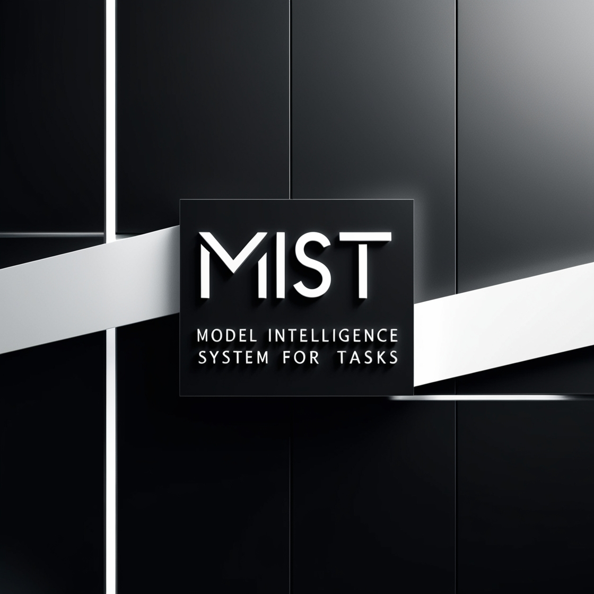
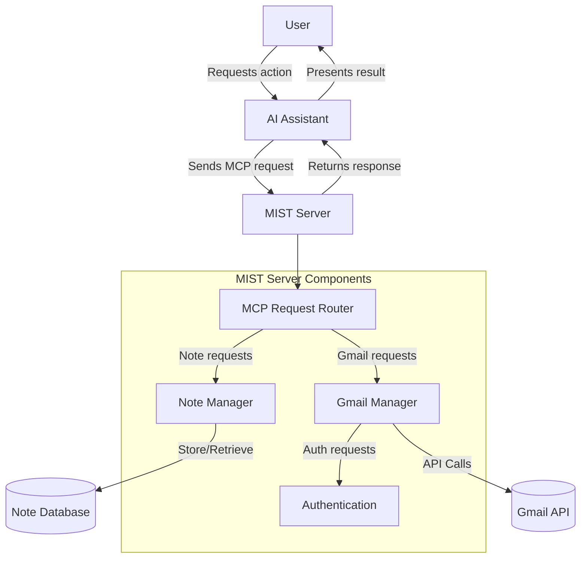
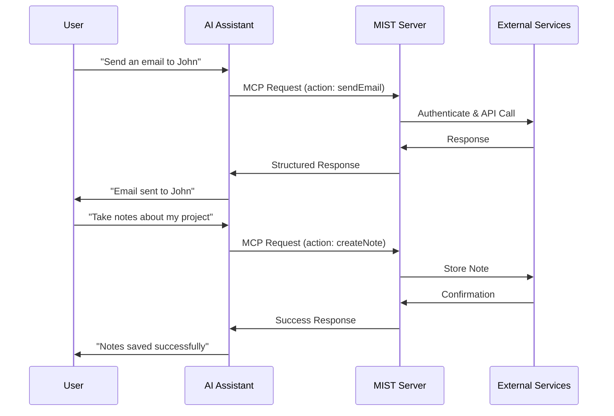
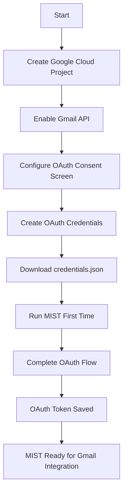
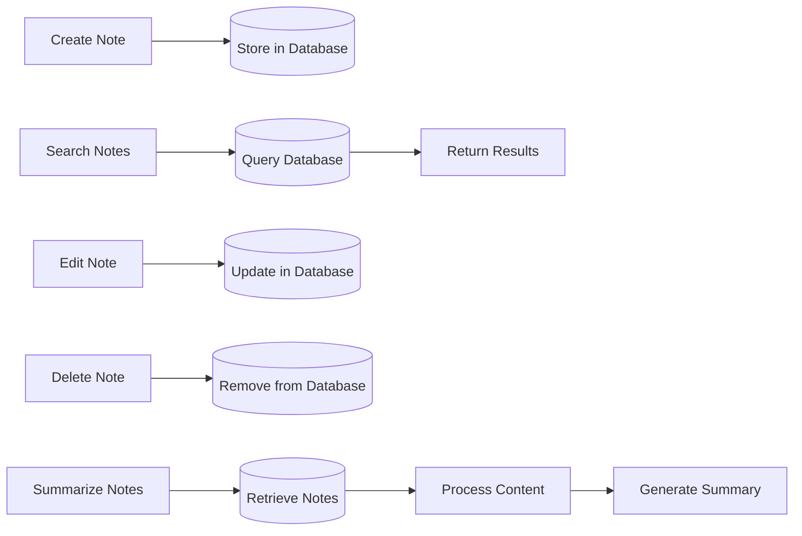
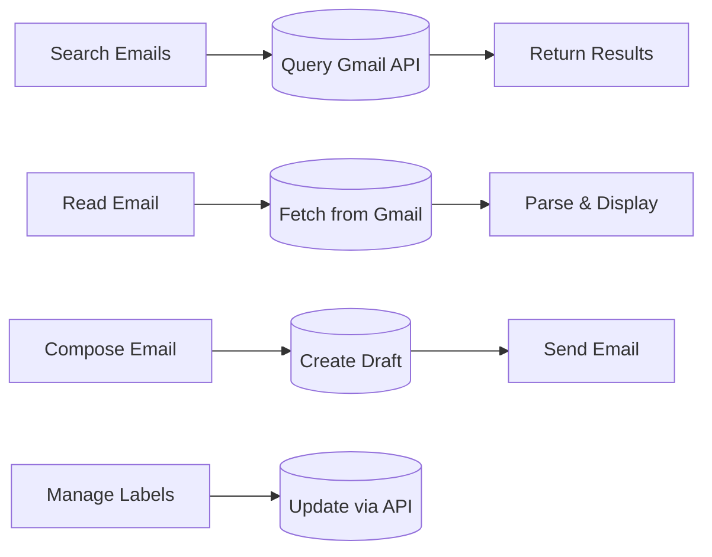

# MIST - Model Intelligence System for Tasks


MIST is a comprehensive MCP (Model Context Protocol) server that empowers AI assistants with real-world capabilities for note-taking and Gmail integration. It bridges the gap between AI assistants and external tools, allowing them to save, edit, create, and delete notes, as well as access and interact with Gmail, including reading messages, searching emails, and sending new messages.

## What is MCP (Model Context Protocol)?

Model Context Protocol (MCP) is an open standard that enables AI assistants to interact with external tools, services, and data sources. Unlike traditional AI that can only respond based on pre-trained knowledge, MCP allows AI models to:

- **Access real-time information** from various sources
- **Perform actions** in external systems and applications
- **Maintain context and state** across interactions
- **Expand capabilities** through standardized tool integration

MCP works as a communication bridge between AI models and external tools through a structured protocol, allowing seamless integration of new capabilities without requiring changes to the AI model itself. By implementing MCP servers like MIST, developers can extend AI capabilities to interact with specific applications and services.

## Features

### Note Management

- Create, read, edit, and delete notes with persistent storage
- Search notes by content, tags, or metadata
- Generate summaries of notes or collections
- Organize notes by subject, date, or custom categories
- Support for rich text formatting and attachments

### Gmail Integration

- Query and search emails with advanced filtering options
- Read complete email content, including attachments
- Compose and send emails with formatting and attachments
- Manage email labels and organization
- Mark messages as read/unread or important
- Batch operations for multiple messages

## How MIST Works

MIST operates as an MCP server that connects AI assistants to note management and Gmail services. When an AI assistant receives a user request requiring access to notes or emails, it communicates with MIST using the MCP protocol. MIST then handles the authentication, data retrieval, and actions with the appropriate services, returning structured data back to the AI assistant.



### Communication Flow

The diagram below illustrates how requests flow through the MIST system:



## Use Cases

- **Personal Knowledge Management**: Create, organize and retrieve notes for projects, research, or daily work
- **Email Management**: Search through emails, draft responses, and manage your inbox without switching contexts
- **Executive Assistant**: Have AI help manage communications and information across multiple systems
- **Research Assistant**: Collect, organize, and retrieve information from various sources
- **Customer Support**: Access email history and draft responses to customer inquiries
- **Content Creation**: Store ideas, outlines, and drafts as you work with AI on content projects

## Installation

### Prerequisites

- Python 3.13 or newer
- UV package manager (recommended) or pip
- Google account (for Gmail integration)

### Setup

1. Clone this repository:

   ```
   git clone https://github.com/yourusername/mist.git
   cd mist
   ```

2. Install dependencies using UV (recommended):

   ```
   uv install
   ```

   Or with pip:

   ```
   pip install -e .
   ```

3. Configure your environment:

   ```
   cp .env.example .env
   ```

   Edit the `.env` file to set your preferred storage locations and options.

## Gmail API Configuration



### Detailed Google Cloud Setup

1. **Create a Google Cloud Project**

   - Go to [Google Cloud Console](https://console.cloud.google.com/)
   - Click on the project dropdown at the top of the page
   - Click "New Project"
   - Enter a project name (e.g., "MCP Gmail Integration")
   - Click "Create"
   - Wait for the project to be created and select it from the dropdown

2. **Enable the Gmail API**

   - In your Google Cloud project, go to the navigation menu (≡)
   - Select "APIs & Services" > "Library"
   - Search for "Gmail API"
   - Click on the Gmail API card
   - Click "Enable"

3. **Configure OAuth Consent Screen**

   - Go to "APIs & Services" > "OAuth consent screen"
   - Select "External" user type (unless you have a Google Workspace organization)
   - Fill in the required application information:
     - App name: "MCP Gmail Integration"
     - User support email: Your email address
     - Developer contact information: Your email address
   - Click "Save and Continue"
   - Add scopes: Add the necessary Gmail scopes (gmail.readonly, gmail.send, gmail.compose, gmail.labels)
   - Click "Save and Continue"
   - Add test users: Add your Google email address
   - Click "Save and Continue"

4. **Create OAuth Credentials**
   - Go to "APIs & Services" > "Credentials"
   - Click "Create Credentials" > "OAuth client ID"
   - Choose "Desktop app" as the application type
   - Enter a name (e.g., "MCP Gmail Desktop Client")
   - Click "Create"
   - Download the JSON file and save it as `credentials.json` in your project root directory

## Usage

### Notes Workflow



### Gmail Workflow



### Running the MCP Server

Start the MCP server:

```
uv run --with mcp[cli] --with-editable . mcp run mist/server.py
```

### Connecting to AI Assistants

#### Claude Desktop

Add the following configuration to your Claude Desktop settings:

```json
{
  "mcpServers": {
    "M.I.S.T.": {
      "command": "uv",
      "args": [
        "run",
        "--with",
        "mcp[cli]",
        "--with-editable",
        "<path-to-mist-directory>",
        "mcp",
        "run",
        "<path-to-mist-directory>/server.py"
      ],
      "env": {
        "MCP_GMAIL_CREDENTIALS_PATH": "<path-to-mist-directory>/credentials.json",
        "MCP_GMAIL_TOKEN_PATH": "<path-to-mist-directory>/token.json",
        "MCP_NOTES_DIRECTORY": "<path-to-notes-directory>"
      }
    }
  }
}
```

#### Zed Editor

Add the following configuration to your Zed editor settings:

```json
"context_servers": {
  "mist-server": {
    "command": {
      "path": "uv",
      "args": [
        "run",
        "--with",
        "mcp[cli]",
        "--with-editable",
        "<path-to-mist-directory>",
        "mcp",
        "run",
        "<path-to-mist-directory>/server.py"
      ],
      "env": {
        "MCP_GMAIL_CREDENTIALS_PATH": "<path-to-mist-directory>/credentials.json",
        "MCP_GMAIL_TOKEN_PATH": "<path-to-mist-directory>/token.json",
        "MCP_NOTES_DIRECTORY": "<path-to-notes-directory>"
      }
    },
    "settings": {
      "enable_server": true
    }
  }
}
```

### First Run

When you first run the server, it will prompt you to authenticate with Gmail. Follow the instructions in the terminal to complete the authentication process:

1. A browser window will open with Google's authentication page
2. Sign in with your Google account
3. Grant the requested permissions
4. The authorization code will be captured automatically, or you'll be instructed to paste it back into the terminal
5. MIST will save the authentication token for future use

## Project Structure

```
mist/
├── server.py             # Main MCP server entry point
├── tools/                # MIST tool implementations
│   ├── note_tools/       # Note-taking functionality
│   │   ├── create.py     # Note creation tools
│   │   ├── read.py       # Note retrieval tools
│   │   ├── update.py     # Note editing tools
│   │   ├── delete.py     # Note deletion tools
│   │   └── search.py     # Note search tools
│   └── gmail_tools/      # Gmail interaction functionality
│       ├── auth.py       # Gmail authentication
│       ├── messages.py   # Email reading/sending
│       ├── search.py     # Email search
│       └── labels.py     # Label management
├── config/               # Configuration files
│   ├── .env.example      # Example environment variables
│   └── config.py         # Configuration handling
├── config_docs/          # Example configuration files
│   ├── claude_config.json  # Claude Desktop config example
│   └── zed_config.json     # Zed editor config example
└── utils/                # Utility functions
    ├── storage.py        # Storage mechanisms
    └── logging.py        # Logging functionality
```

## Troubleshooting

### Common Issues

#### Authentication Problems

- Ensure your `credentials.json` file is correctly placed in the root directory
- Check that you've granted the necessary permissions during OAuth flow
- Delete `token.json` and re-authenticate if credentials have expired

#### Connection Issues

- Verify your AI assistant is configured to use the correct MCP server path
- Check for any firewall or network restrictions
- Ensure the server is running before attempting to connect

#### Gmail API Limitations

- Be aware of Gmail API quotas and limits
- Some operations may require additional scopes or permissions

## Contributing

Contributions are welcome! To contribute:

1. Fork the repository
2. Create a feature branch (`git checkout -b feature/amazing-feature`)
3. Commit your changes (`git commit -m 'Add some amazing feature'`)
4. Push to the branch (`git push origin feature/amazing-feature`)
5. Open a Pull Request

Please make sure to update tests as appropriate and follow the coding standards of the project.

## License

This project is licensed under the MIT License - see the LICENSE file for details.
